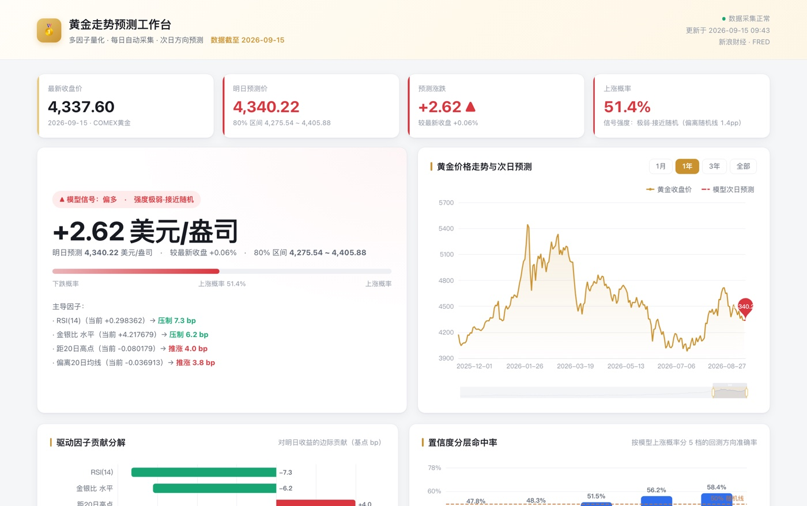
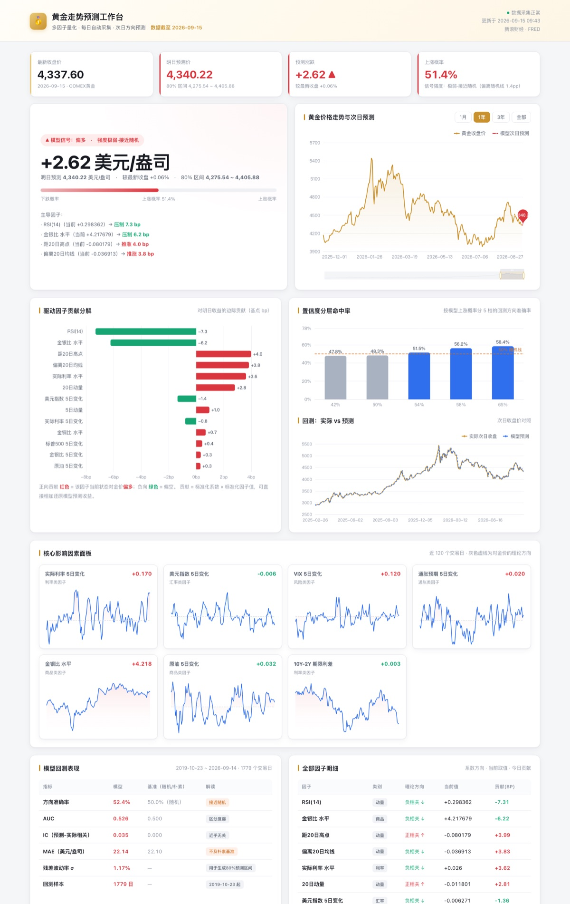

# 黄金走势预测工作台

自动采集每日黄金价格与全球影响因素，多因子建模，预测次日走势，输出可视化工作台。

数据源全部**免费、无需 API Key**，工作台是**单文件、可离线打开**的。



> **在线预览**：<https://jw319.github.io/my-tools/黄金预测/dashboard.html>
> （中文路径在部分浏览器地址栏里会被转义，若打不开就直接下载 `dashboard.html` 双击打开，它是自包含的）

---

## 快速开始

```bash
./run_daily.sh          # 采集 → 建模 → 生成工作台（约 15 秒）
open dashboard.html     # 打开工作台
```

---

## 项目结构

```
黄金预测/
├── run_daily.sh              一键：采集 + 建模 + 生成工作台
├── dashboard.html            ★ 交付物：单文件工作台（内嵌图表库与数据，可离线打开）
├── assets/
│   └── echarts.min.js        图表库（Apache-2.0，构建时内联进 HTML）
├── docs/
│   ├── preview.jpg           首屏预览
│   └── preview-full.jpg      整页预览
├── scripts/
│   ├── collect.py            数据采集 → SQLite + 宽表 CSV
│   ├── model.py              特征工程 + 走前式回测 + 次日预测
│   ├── build_dashboard.py    把预测结果注入模板，生成 dashboard.html
│   ├── template.html         工作台 HTML 模板
│   ├── experiment.py         对照实验：水平值 vs 滚动标准化
│   └── experiment2.py        对照实验：模型与正则强度扫描
└── data/                     ← 已 gitignore，脚本可重新生成
    ├── gold.db               SQLite（约 7MB）
    ├── market.csv            宽表：日期 × 全部指标
    ├── features.csv          特征矩阵
    ├── backtest.csv          逐日回测明细
    └── prediction.json       ★ 最新预测结果
```

> `data/` 不入库是有意为之：约 10MB，且每天都会变，提交进来只会让仓库膨胀、diff 全是噪音。
> `assets/echarts.min.js` 则是有意入库的 1MB 第三方依赖——这样 `build_dashboard.py`
> 在完全离线的环境下也能构建出可离线打开的工作台。

---

## 数据源

| 类别 | 来源 | 内容 |
|---|---|---|
| 黄金/白银/原油/铜 日线 | 新浪财经国际期货接口 | COMEX 黄金 2016 年至今 2589 个交易日 |
| 实时行情 | 新浪财经 | 伦敦金现货、COMEX 黄金、上海金 T+D |
| 宏观因子 | FRED（圣路易斯联储） | 实际利率、美元指数、VIX、通胀预期、收益率、原油、标普500 |

### 两个必须知道的坑

1. **FRED 会拦截浏览器型 User-Agent。** 用 `Mozilla/...` 请求 `fredgraph.csv` 会一直挂到超时，
   换成 `python-requests` 或 `curl` 型 UA 则 0.5 秒返回。代码里两个数据源用了独立 Session 处理。

2. **`reindex(method="ffill")` 不会填充源序列自身已有的 NaN。**
   FRED 在「美国休市但黄金仍交易」的日子（元旦、耶稣受难日、哥伦布日、感恩节）没有数据，
   直接对齐会留下空洞，导致 5 日差分变 NaN、滚动统计彻底失效。
   正确做法是把源序列 `dropna()` 后在「并集索引」上 ffill。修这个 bug 让有效样本从 2136 天恢复到 2528 天。

---

## 模型设计

**预测目标**：次日对数收益（`log(P_{t+1} / P_t)`），同时输出方向概率。

**20 个因子**，分 5 类：

| 类别 | 因子 |
|---|---|
| 利率 | 实际利率 5 日变化、实际利率水平、10Y-2Y 期限利差 |
| 汇率 | 美元指数 5 日变化、美元指数水平 |
| 风险 | VIX 5 日变化、标普500 5 日变化 |
| 通胀/商品 | 通胀预期 5 日变化、原油 5 日变化、金银比、金铜比 |
| 动量 | 1/5/20 日动量、偏离 20/60 日均线、20 日波动率、RSI(14)、距 20 日高点 |

**模型**：
- 收益幅度 → `RidgeCV`（L2 正则，α 由交叉验证选）
- 方向概率 → `LogisticRegression`（C=0.05，强正则）
- 因子贡献 → 标准化系数 × 标准化因子值，可直接相加还原预测收益（线性模型的天然可解释性）

### 关键设计决策（都有实验支撑）

| 决策 | 理由 |
|---|---|
| **不用 LSTM / 深度学习** | GitHub 同类项目实测：在有限样本上堆外部因子 + LSTM 严重过拟合，反而跑不过朴素基准 |
| **只用因子「变化量」不用绝对水平做趋势外推** | 避免非平稳序列造成的伪回归 |
| **严格按真实发布滞后对齐** | 美元指数滞后 7 天、CPI/联邦基金利率滞后 30 天，杜绝未来数据泄露 |
| **信用利差因子不进入模型** | FRED 该序列仅追溯至 2023-09，纳入会让样本从 2530 天骤降至 606 天，得不偿失 |
| **不做滚动标准化** | 实测滚动 z-score 反而更差（51.6% vs 52.4%），保留原始水平值 |
| **不用 GBDT** | 实测 GBDT(53.4%) 仅比线性(52.5%) 高 0.9pp，在噪声范围内（n=1779 时标准误约 1.2pp），不值得牺牲可解释性 |

---

## 诚实的模型表现

走前式回测（2019-10-23 ~ 2026-09-14，1779 个交易日，每月重训）：

| 指标 | 模型 | 基准 | 结论 |
|---|---|---|---|
| 方向准确率 | **52.5%** | 50%（随机） | 略优于随机 |
| AUC | 0.526 | 0.500 | 区分度弱 |
| IC | 0.035 | 0.000 | 近乎无关 |
| MAE | 22.13 | 22.10（朴素） | 与朴素持平 |

**唯一有实用价值的发现**：把预测概率分 5 档后，方向命中率呈现单调上升：

| 概率档 | 平均上涨概率 | 方向命中率 |
|---|---|---|
| 最低档 | 42% | 47.5% |
| 第 2 档 | 50% | 51.0% |
| 第 3 档 | 54% | 51.6% |
| 第 4 档 | 58% | **56.5%** |
| 最高档 | 65% | **56.4%** |

也就是说，**模型在高置信度时的判断才相对可靠（约 56%）**，低置信度时应视为噪声。
工作台把这个分层结果单独画出来了。

---

## 自动化

已配置定时任务，**每天 07:00** 自动执行 `collect.py → model.py → build_dashboard.py`。
选这个时间点是因为美股已收盘（北京时间 05:00 前后），能拿到完整的当日行情与 FRED 数据。

工作台整页效果：



---

## 风险提示

1. 黄金日频方向的可预测性天然很弱，长期稳定超过 55% 极为困难。
   本工作台的价值在**纪律化的因子监控与归因**，不是"精准预测点位"。
2. 预测区间由回测残差分布给出（80% 置信度），单日实际波动可能超出区间。
3. 回测无未来数据泄露，但不代表实盘有同样的信息优势。
4. **本工具仅供量化研究与数据可视化，不构成任何投资建议。**
